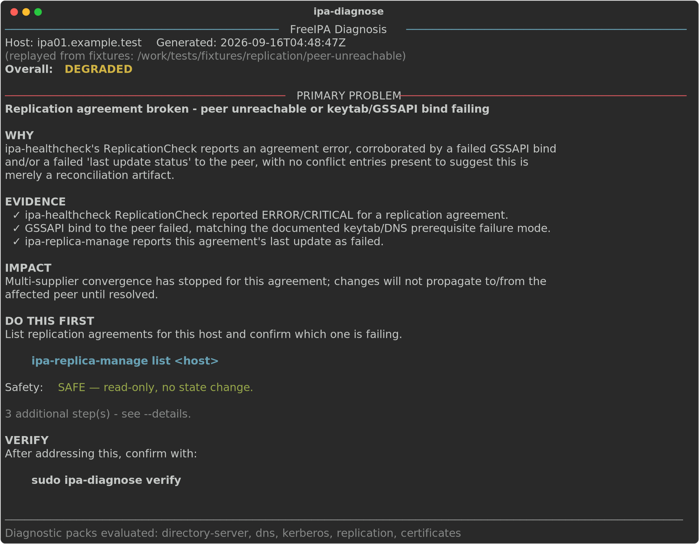
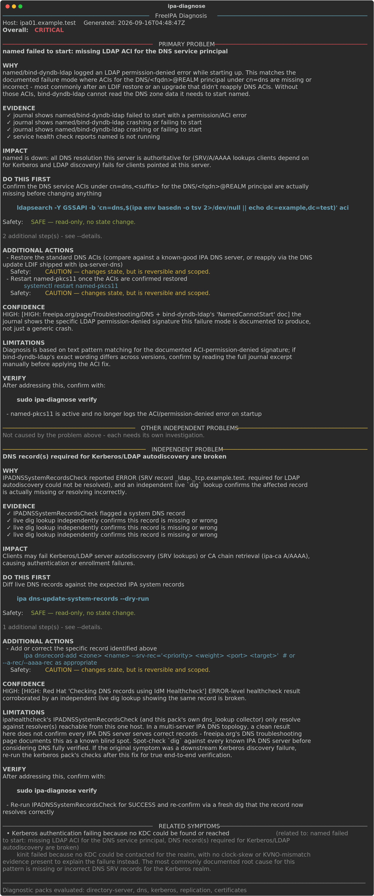
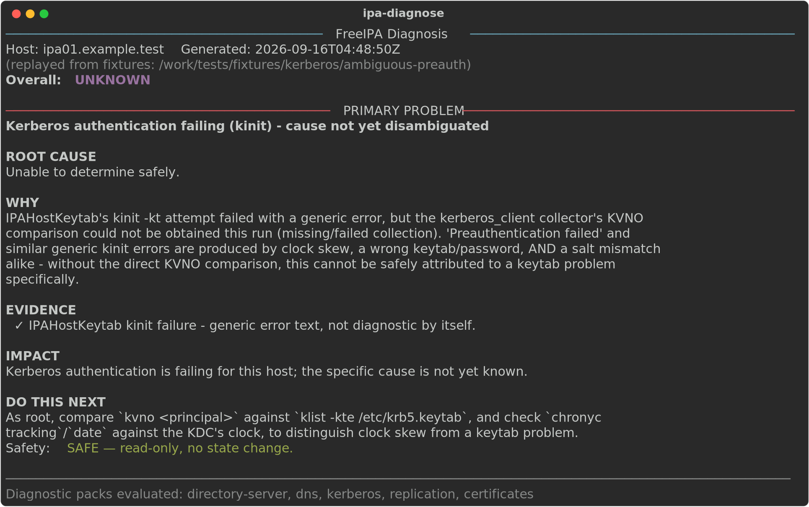

# ipa-diagnose

**`ipa-healthcheck` tells you a check failed. `ipa-diagnose` tells you which
failures are related, what's actually wrong, why you should believe that,
what it affects, what to do first, whether that's safe, and how to confirm
it's fixed.**

It is a deterministic, evidence-grounded correlation engine that sits on top
of `ipa-healthcheck` plus a handful of targeted, read-only collectors
(`journalctl`, `getcert list`, `ipa-replica-manage`, `dig`, `klist`/`kvno`,
read-only `ldapsearch`). AI (OpenAI, Anthropic, or AWS Bedrock) is entirely
optional and only ever explains a diagnosis the deterministic engine already
computed - it never decides the root cause, invents evidence, or invents a
command to run.



## Why this exists

`ipa-healthcheck` is FreeIPA's own excellent diagnostic tool, and
`ipa-diagnose` does not reimplement or replace it - it reads its JSON output.
But by design, `ipa-healthcheck` only checks one host in isolation: it does
not correlate two related failures into one story, does not read logs, does
not explain impact, and does not recommend a next step (this is confirmed by
reading its own source and documentation, not assumed - see
[docs/research.md](docs/research.md)). An administrator staring at ten
failing checks after a bad night still has to work out, by hand, which one
is the actual problem and which nine are just symptoms.

`ipa-diagnose` is the layer that does that correlation, deterministically,
with every claim traceable back to real evidence:

```text
DETECT → COLLECT EVIDENCE → CORRELATE → DIAGNOSE → EXPLAIN → RECOMMEND → VERIFY
```

## Example

Three independent-looking `ipa-healthcheck` failures - a DNS record check, a
`named` service check, and a Kerberos KDC-discovery failure on a client -
turn out to be one problem:



And when the evidence genuinely isn't enough to tell two causes apart,
`ipa-diagnose` says so instead of guessing:



See [artifacts/screenshots/index.md](artifacts/screenshots/index.md) for all
19 captured scenarios (healthy, degraded, multiple independent problems,
`--details`, CAUTION/HIGH-RISK actions, `verify`, all three AI providers,
AI-failure fallback, the `ai-preview` redaction view, malformed input, and
the real RPM install) - every one of them is real recorded output from the
actual application, not a mockup.

## Installation

**Available now - PyPI/pipx** (works on any RHEL/CentOS/Fedora host with
Python 3.9+, and is also the right path for development, testing, and early
adoption):

```bash
pipx install ipa-diagnose
sudo ipa-diagnose
```

**Available now - RPM, via the GitHub Release** (built and lifecycle-tested
- install, dependency resolution, `--version`, CLI startup, graceful
degradation without a live FreeIPA environment, uninstall - in Docker
against a clean Fedora container; see
[packaging/rpm/README.md](packaging/rpm/README.md) for how):

1. Download `ipa-diagnose-0.1.0-1.fc44.fc44.noarch.rpm` from the
   [v0.1.0 release](https://github.com/InfraGuard-Labs/ipa-diagnose/releases/tag/v0.1.0).
2. Run:
   ```bash
   sudo dnf install ./ipa-diagnose-0.1.0-1.fc44.fc44.noarch.rpm
   sudo ipa-diagnose
   ```

**Not yet available** - a COPR repository, so that `sudo dnf install
ipa-diagnose` works directly without downloading a file first:

```bash
# Not yet published:
sudo dnf copr enable <maintainer>/ipa-diagnose
sudo dnf install ipa-diagnose
sudo ipa-diagnose
```

See [packaging/rpm/README.md](packaging/rpm/README.md) for the one
remaining manual publish step, and for how to build/test the RPM yourself
in Docker.

`ipa-diagnose` needs to run where `ipa-healthcheck` and the FreeIPA/389-DS
tooling it shells out to already exist - i.e., on an actual IPA server or
client, as root (or with `sudo`).

## Quick start

```bash
sudo ipa-diagnose                 # diagnose (default)
sudo ipa-diagnose --details       # full evidence, confidence, every action
sudo ipa-diagnose --json          # machine-readable, for automation
sudo ipa-diagnose verify          # did the problem actually clear?
sudo ipa-diagnose ai-preview      # see exactly what would be sent to an AI provider
sudo ipa-diagnose --no-ai         # never contact any AI provider (also the default)
```

Try it without a live FreeIPA host, against the same fixtures used in
testing and screenshots:

```bash
docker compose run --rm dev ipa-diagnose --replay tests/fixtures/replication/peer-unreachable diagnose
```

## Architecture

```text
ipa-healthcheck JSON  +  targeted read-only evidence
        │           (journalctl, getcert, ipa-replica-manage, dig, klist/kvno, ldapsearch)
        ▼
Evidence Normalizer  (every fact keeps its provenance: which command produced it)
        ▼
Privacy / Redaction  (secret detection + minimum-evidence-selection, before anything
        │             could reach an AI provider - see docs/security-privacy.md)
        ▼
Diagnostic Engine  (5 versioned packs: replication, certificates, kerberos, dns,
        │           directory-server - see docs/diagnostic-packs.md)
        ▼
Correlation + Prioritization  (deterministic - PRIMARY / RELATED SYMPTOM /
        │                      SECONDARY INDEPENDENT / WARNING; UNKNOWN is a first-class outcome)
        ▼
Structured Diagnosis
   ┌────────┴────────┐
   ▼                 ▼
Local Explanation   Optional AI (OpenAI | Anthropic | Bedrock) - explains only,
   └────────┬────────┘          never decides (see docs/ai-configuration.md)
            ▼
           CLI
            ▼
        Verification  (`ipa-diagnose verify` re-collects evidence and re-diagnoses -
                        never trusts a remediation command's exit code alone)
```

Full writeup, including the design rationale for each stage, is in
[docs/architecture.md](docs/architecture.md).

## Supported diagnoses (v1)

Five diagnostic packs, chosen because they're where `ipa-healthcheck`'s own
single-host, no-correlation, no-log-analysis design leaves the most value on
the table (see [docs/research.md](docs/research.md) for the full gap
analysis against `ipa-healthcheck`):

| Pack | Covers | Ambiguity it explicitly refuses to guess through |
|---|---|---|
| **Replication** | Peer connectivity breaks, replication conflicts, stale RUVs, topology disconnection | Conflict entries mean replication *is* transmitting writes, not that it's broken - a documented trap this pack does not fall into |
| **Certificates / CA** | Stuck certmonger renewals, expired certs, RA-agent/Dogtag desync, unreachable renewal master | `CA_UNREACHABLE` has 3+ unrelated root causes sharing one state name; only DIAGNOSES when the actual error text is specific enough |
| **Kerberos** | Clock skew, keytab/KVNO mismatch, DNS-caused KDC discovery failure | "Preauthentication failed" is a generic bucket produced by all three causes - only a direct KVNO comparison counts as proof of a keytab problem |
| **DNS** | `named`/bind-dyndb-ldap down, forward-zone/empty-zone collisions, broken SRV/autodiscovery records | A documented `ipa-healthcheck` false-positive (issue #270) means WARNING-only SRV findings are treated with extra skepticism, not trusted blindly |
| **Directory Server / LDAP** | Disk exhaustion, ownership/SELinux mismatches, NSS/TLS DB format issues, missing indexes | An NSS DB format mismatch looks exactly like an expired certificate - this pack explicitly says so rather than misattributing it |

Each pack's rules, sourcing, and confidence levels are documented in
[docs/diagnostic-packs.md](docs/diagnostic-packs.md).

## The evidence model

Every `Finding` and `EvidenceItem` the engine reasons about carries a
`Provenance` - the exact command that produced it. `--details` shows this;
nothing is ever "the tool just knows this." Full model in
[docs/architecture.md](docs/architecture.md#evidence-model).

## Diagnostic packs, in one sentence each

See [docs/diagnostic-packs.md](docs/diagnostic-packs.md) for the full
evidence/confidence/action/verification breakdown per rule, with citations.

## Security and privacy

FreeIPA is identity infrastructure; `ipa-diagnose` treats all evidence as
potentially sensitive. Before anything can reach an external AI provider, it
passes through: normalization → minimum-evidence-selection (only what a
diagnosis actually cites) → secret detection (field-name **and**
pattern-based) → redaction → truncation. Run `ipa-diagnose ai-preview` to see
the *exact* payload that would be sent, every time, with a redaction summary
- the preview and the real call share the same code path, so it cannot lie
to you. Full detail, including the adversarial tests (prompt injection,
secret leakage, command injection, malformed input) in
[docs/security-privacy.md](docs/security-privacy.md).

## AI configuration (entirely optional)

```bash
export OPENAI_API_KEY=...       && sudo ipa-diagnose --ai-provider openai
export ANTHROPIC_API_KEY=...    && sudo ipa-diagnose --ai-provider anthropic
# Bedrock uses boto3's normal credential chain (IAM role, env vars, ~/.aws/)
sudo ipa-diagnose --ai-provider bedrock
```

AI provider SDKs are optional extras - `pip install ipa-diagnose[openai]`,
`[anthropic]`, `[bedrock]`, or `[ai]` for all three - so the base install has
no AI-related dependencies at all, and `--no-ai` (the default) requires
none of them. If a provider fails, times out, or returns something that
looks like a fabricated command, `ipa-diagnose` silently falls back to the
local, deterministic explanation - it never blocks or degrades the core
diagnosis. Full detail in [docs/ai-configuration.md](docs/ai-configuration.md).

## Verification

```bash
sudo ipa-diagnose verify
```

Re-collects evidence and re-runs the full diagnostic engine, then diffs the
result against the last run - `RESOLVED`, `STILL_PRESENT`,
`PARTIALLY_RESOLVED`, or `UNABLE_TO_VERIFY`. It never claims success just
because a remediation command happened to exit `0` (a real, documented
FreeIPA case - `ipa group-del` reporting "Insufficient access" while still
deleting the group - is exactly the kind of false signal this avoids). Full
detail in [docs/verification.md](docs/verification.md).

Something not behaving as expected? See
[docs/troubleshooting.md](docs/troubleshooting.md) first.

## Development (Docker only)

Nothing is installed on the host - everything runs inside the `ipa-diagnose`
Docker Compose project:

```bash
docker compose build dev
docker compose run --rm test          # full test suite
docker compose run --rm dev bash      # interactive shell
```

99 tests: unit tests for the engine/correlation/redaction core, per-pack
fixture tests (one directory per scenario under `tests/fixtures/`, each with
an expected outcome in `meta.json`), and an adversarial suite covering false
correlation, prompt injection, secret leakage, command injection, and
malformed/oversized input. See [docs/limitations.md](docs/limitations.md)
for what's fixture-validated vs. container-integration-tested vs. genuinely
real-FreeIPA-validated - this project does not overclaim which is which.

## Limitations

- **Single-host by design**, same as `ipa-healthcheck` itself - some
  questions (is every DNS server in the topology serving correct records?
  has RUV fully converged across all masters?) genuinely need a multi-host
  view this tool doesn't have. Where a rule's confidence is capped for this
  reason, it says so in `--details`.
- **v1 covers 5 diagnostic packs**, not every FreeIPA subsystem. See
  [docs/limitations.md](docs/limitations.md) for the full list of what's
  deliberately out of scope for now.
- **Diagnosis-first, not auto-remediation.** `ipa-diagnose` never executes a
  CAUTION or HIGH-RISK action automatically, and v1 has no "fix it for me"
  mode. That is a deliberate scope decision, not a missing feature.

## Contributing

See [docs/contributing.md](docs/contributing.md) - in short: everything
builds and tests in Docker, every new diagnostic rule needs a fixture with
an expected outcome, and "I'm not sure" (`UNKNOWN_*`) is always an
acceptable, often correct, answer for a rule to give.

## License

Apache-2.0. See [LICENSE](LICENSE).
