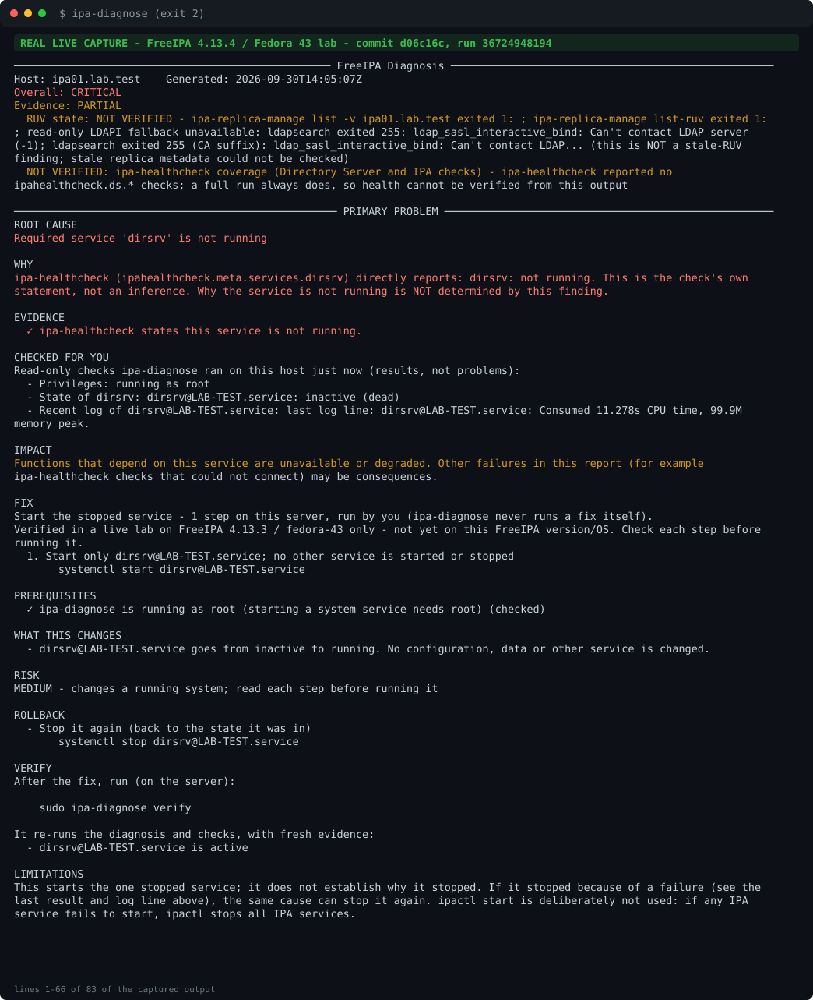
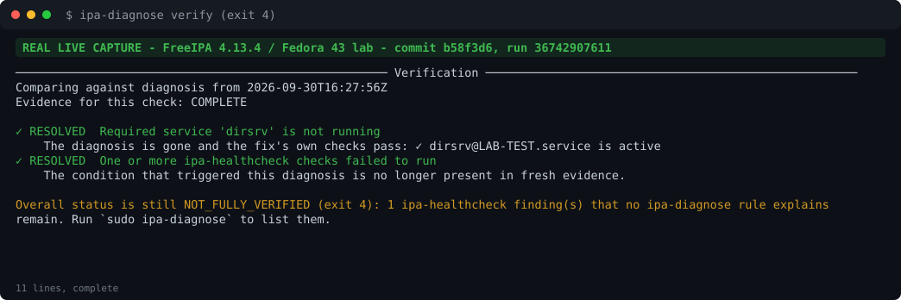
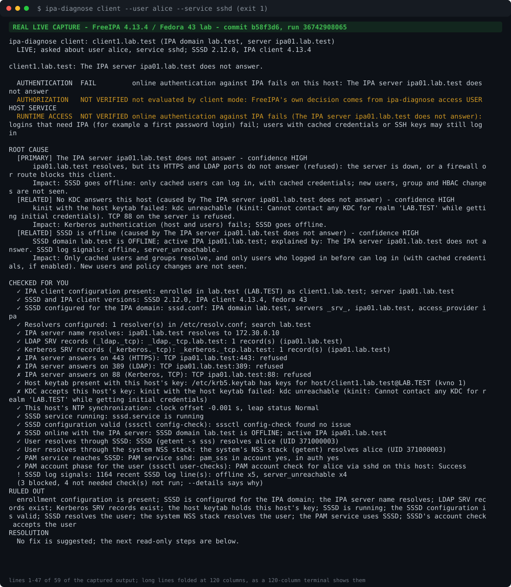
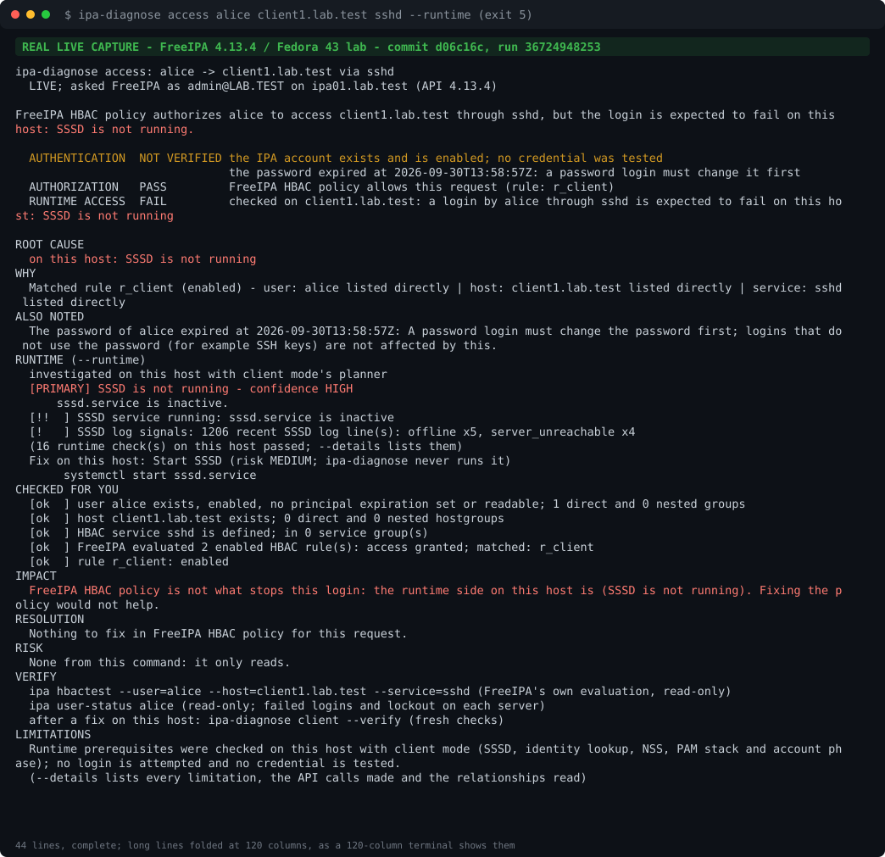
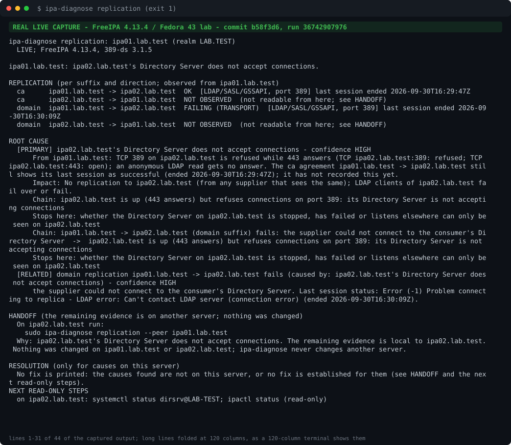
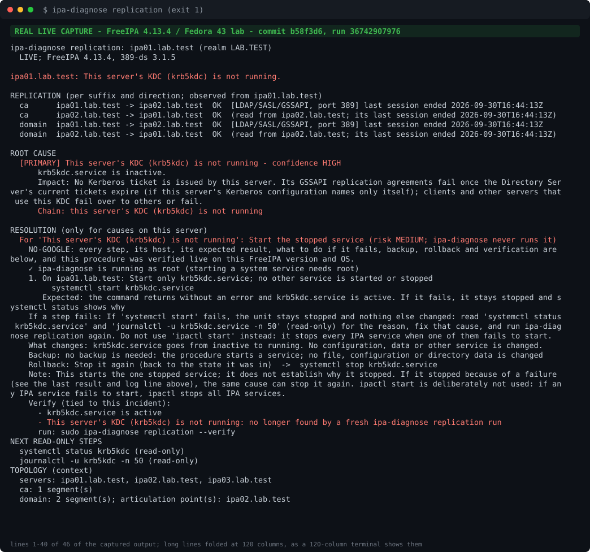
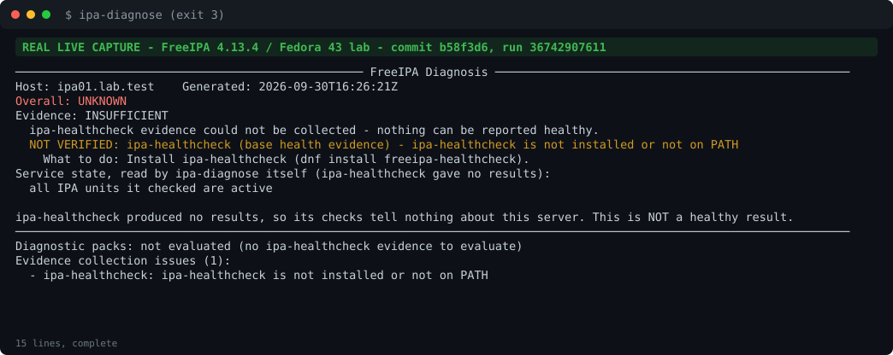

# ipa-diagnose

**Evidence-backed root causes for FreeIPA / Red Hat IdM: servers, clients, access policy and replication. When a fix
passes its safety gates it prints the fix (it never runs it), and `verify` then re-checks with fresh evidence whether
the original problem is gone.**

> Live-validated only on Fedora 43 with FreeIPA 4.13.3/4.13.4 in disposable lab containers - not yet on RHEL IdM or
> any EL distribution (those are packaging-tested only). What was tested where: [Supported and validated
> environments](#supported-and-validated-environments).

```text
DETECT → INVESTIGATE → CORRELATE → ROOT CAUSE → RESOLVE → VERIFY
```

`ipa-healthcheck` tells you which checks failed on one host. `ipa-diagnose` reads its output, runs its own read-only
checks and works out which failures are one problem, what the deepest proven cause is, and what was ruled out. It
never runs a fix: when it can prove a fix applies here and is safe, it prints the exact command, the expected result,
the rollback and how to verify, and otherwise it says why it shows none. When the evidence is not enough, the answer
is `UNKNOWN` or *undiagnosed*, never a guess. The engine is deterministic. AI is optional and can only reword a
diagnosis that is already computed.

## What it does

| # | Capability | Command | Question it answers | Limit (not claimed) |
|---|---|---|---|---|
| 1 | Diagnose a FreeIPA server | `sudo ipa-diagnose` | What is wrong on this server? | One host's view; covers ipa-healthcheck plus 5 diagnostic packs (replication, certificates, Kerberos, DNS, Directory Server), not every subsystem |
| 2 | Correlate failing checks | same | Which failures are one problem, which are symptoms, which are independent? | A fixed, documented causal model (DNS → Kerberos → replication → certificates, Directory Server under all); a new kind of link shows up as two problems |
| 3 | Reach the deepest supported root cause | `ipa-diagnose`, `client`, `replication` | What is the deepest cause the evidence proves? | Stops where the evidence stops and names the next read-only step |
| 4 | Show evidence and what was ruled out | `--details` | Why should I believe it? | Every fact carries the command that produced it and whether it is LIVE or recorded |
| 5 | Print a safe, complete fix when one is proven | printed `FIX` | What exactly do I run, where, and what should happen? | Printed, never run. 7 procedures; 3 applied verbatim and verified in the live lab (start a stopped IPA service, restore an IPA file's owner/group/mode, start SSSD) |
| 6 | Verify recovery with fresh evidence | `verify`, `client --verify`, `replication --verify` | Is the original incident really gone? | Never trusts the fix command's exit code; RESOLVED needs fresh evidence and the fix's own checks; replication can answer PENDING |
| 7 | Diagnose HBAC access policy | `ipa-diagnose access USER HOST SERVICE` | Does FreeIPA policy allow this, and why? | The decision is FreeIPA's own `hbactest`; a deny is policy, never "broken"; trusted-domain (AD) users are UNKNOWN |
| 8 | Continue from policy into the runtime side | `access ... --runtime` (as root on HOST) | Policy allows it, but would the login fail on this host? | No login is attempted: RUNTIME ACCESS is FAIL or NOT VERIFIED, never PASS |
| 9 | Diagnose a FreeIPA client and SSSD | `sudo ipa-diagnose client [--user U --service S]` | Is this client enrolled and able to resolve and authenticate IPA identities? | No credential is tested; one host; never prints `rm /var/lib/sss/db/*`, re-enrollment, keytab replacement or a clock step (the only cache removal it can print is a gated `sssctl cache-remove`, tested on recorded evidence only, after you accept losing offline logins) |
| 10 | Diagnose replication per suffix and direction | `sudo ipa-diagnose replication [--peer FQDN]` | Does replication to and from this server work, and what is the deepest cause? | One server's view; the reverse direction needs your Kerberos ticket; never prints re-initialization, RUV clean-up or topology changes |
| 11 | Model the environment it reasons about | `replication` (topology, roles, segments) | Which servers, roles and paths matter for this answer? | A bounded, per-run, lookup-only model (at most 8 agreements per run); not a directory mirror |
| 12 | Create a privacy-reduced support bundle | `sudo ipa-diagnose bundle [--preview]`, `bundle validate FILE` | What can I hand to someone helping me? | Pseudonymized and credential-scanned, **not** secret-free: review it before sharing; nothing is uploaded |
| 13 | Produce JSON | `--json` on every command | Can a script consume the answer? | Versioned schemas; `--json` is pure JSON on stdout |
| 14 | Explain with AI (optional) | `--ai-provider openai\|anthropic\|bedrock`, `ai-preview`, `--no-ai` | Can the diagnosis be reworded in plain language? | Server diagnoses only; AI never chooses the cause or supplies a command; `ai-preview` shows the exact payload |

## See it in action

Every image below is the exact text `ipa-diagnose` printed in the live lab (FreeIPA 4.13.4 on Fedora 43, disposable
containers on a GitHub runner, fake `lab.test` names), sometimes shortened to a line range and with long lines folded at
120 columns; each image's footer says which. They are not mock-ups. The faults were injected on purpose and the tool
was not told what they were. Commands, commits, runs, raw captures and limits for each image:
[docs/screenshots/1.0-candidate/](docs/screenshots/1.0-candidate/index.md).

**Root cause, evidence and the printed fix.** The Directory Server is stopped. ipa-diagnose names the unit and prints
`systemctl start` for exactly that unit. It does not print `ipactl start`, which stops every IPA service when one of
them fails to start.



**Verify with fresh evidence.** The printed command was run as shown, then `ipa-diagnose verify` re-collected
everything and compared it with the last saved diagnosis. Both items are RESOLVED; the exit code stays 4
(NOT_FULLY_VERIFIED) because one unrelated upstream warning, caused by the lab container, is still unexplained, and
ipa-diagnose never calls a run healthy while that is so:



**A client and SSSD.** The IPA server's ports are blocked from the client. The unreachable server is the cause, and
SSSD being offline is shown as a consequence of it, not as a second problem:



**Policy vs runtime.** FreeIPA's HBAC policy allows alice, but SSSD is stopped on the host. AUTHORIZATION stays
FreeIPA's decision, RUNTIME ACCESS fails, and no login is attempted:



**Replication: a cause chain across servers.** ipa02's Directory Server was stopped for the test. Seen from ipa01, the
chain stops at what ipa01 can prove ("ipa02.lab.test is up (443 answers) but refuses connections on port 389"), and ipa-diagnose prints the command
to run on ipa02 instead of changing anything there:



**A complete fix, when it is proven.** This server's own KDC is stopped. Every step shows its host, its expected
result, what to do if it fails, backup, rollback and verification tied to the incident:



**No guessing.** With `ipa-healthcheck` unavailable there is no base evidence, so the answer is UNKNOWN (exit 3),
never healthy:



## Quick start

```bash
sudo ipa-diagnose                    # on an IPA server: diagnose (the default command)
sudo ipa-diagnose --details          # full evidence, confidence, what each check found
sudo ipa-diagnose --json             # machine-readable, for monitoring and automation
sudo ipa-diagnose verify             # after a fix: is the problem found last time really gone?

kinit alice; ipa-diagnose access john app03.example.test sshd      # any enrolled host, no root: does policy allow it?
sudo ipa-diagnose access john app03.example.test sshd --runtime    # as root on app03 itself: would the login fail?

sudo ipa-diagnose client --user john --service sshd                # on a client: enrolled, resolving, why not?
sudo ipa-diagnose replication                                      # on a server: per suffix and direction, why not?

sudo ipa-diagnose bundle --preview   # what a support bundle would contain; writes nothing
sudo ipa-diagnose bundle             # write one (review it before sharing; nothing is uploaded)

sudo ipa-diagnose ai-preview         # exactly what an AI provider would receive
sudo ipa-diagnose --no-ai            # never contact an AI provider (also what happens when none is configured)
```

`access` asks FreeIPA with your own Kerberos ticket (any authenticated IPA user can normally run the HBAC evaluation);
`sudo` does not pass your ticket on, so for `access --runtime` and for the reverse replication direction get the ticket
in the root session itself: `sudo -i`, `kinit <user>`, then run the command. To try it without a FreeIPA host, replay recorded evidence from a git
checkout: `ipa-diagnose --replay tests/fixtures/resolution/service-not-running`. Replayed output is labelled as such.

**In monitoring, alert on any non-zero exit.** For the server diagnosis: 0 HEALTHY, 1 DEGRADED, 2 CRITICAL,
3 UNKNOWN, 4 NOT_FULLY_VERIFIED; `access --runtime` adds 5 (policy allows, the host would refuse) and
`replication --verify` 3 (PENDING). 3 and 4 never count as OK. Every command's codes:
[docs/exit-codes.md](docs/exit-codes.md).

## How it stays safe

- **Investigation is read-only, with one upstream exception.** Every check is a fixed command (no shell) with a
  timeout. The exception:
  ipa-healthcheck's certificate checks start a stopped certmonger unless it is masked, and the report says when that
  happened.
- **Fixes are printed, never executed.** A fix appears only when its values come from structured evidence and
  validate as safe values of their type, the FreeIPA version is in range, fresh read-only checks find nothing
  contradicting, and the prerequisites are met. Otherwise the report says "No fix is shown" and why.
- **Procedures are evidence-gated data** (`knowledge/procedures/`). Each has a knowledge tier, and the output says
  where it was verified live. A symptom (RELATED) never gets its own fix, and neither does a cause on another server.
  For a diagnosis no procedure covers, the console shows only read-only next steps; older state-changing guidance
  stays only in the v1 JSON `actions` list, for compatibility, and is not meant to be run from there.
- **Dangerous recovery is withheld on purpose.** It never prints `ipactl start`, `rm /var/lib/sss/db/*`, re-enrollment,
  keytab replacement, clock steps on clients, re-initialization, force-sync, RUV clean-up or topology changes. The
  reason is explained and the decision is left to you.
- **The core is deterministic.** The same evidence gives the same answer, and every claim traces back to evidence.
  `UNKNOWN` is a first-class answer.
- **AI only explains.** It is optional, it only sees what the privacy pipeline allows (`ai-preview` shows exactly
  that), and its text is discarded if it contains anything that looks like a command.

## Architecture

```text
            SERVER               ACCESS                   CLIENT                  REPLICATION
  L0  ipa-healthcheck +      read-only FreeIPA       closed read-only check registry (SSSD, DNS, TCP, TLS, clock,
      staged collectors      JSON-RPC (hbactest)     keytab, KDC, NSS, PAM | LDAPI topology, peers, GSSAPI bind)
  L1  typed evidence with provenance: the command that produced each fact, when, LIVE or REPLAY
  L2  causal chain           relationship index      facts of earlier steps  EnvironmentGraph
  L3  staged collection      fixed call sequence     bounded deterministic planner (steps, gates, budgets, trace)
  L4  packs + correlation    FreeIPA decides         diagnosis rules         cause chains (registered discriminators)
      -> PRIMARY / RELATED / INDEPENDENT / UNDIAGNOSED / CONTRADICTING; UNKNOWN is a first-class answer
  L5  resolution: procedure catalogue + gates, printed only (replication adds Resolution Safety + No-Google gates)
  L6  verification with fresh evidence: RESOLVED / STILL_PRESENT / PARTIALLY_RESOLVED / CHANGED / UNABLE_TO_VERIFY
      (replication also PENDING)
  side paths: support bundle (pseudonymized structure, fail-closed leak self-test) | optional AI (explains only)
```

Details: [docs/architecture.md](docs/architecture.md).

## Installation

**RPM** (recommended when you run it as root, which the server and client commands need). Download the file for your
platform from the [latest release](https://github.com/InfraGuard-Labs/ipa-diagnose/releases/latest). The packages are
not GPG-signed: check the file against `SHA256SUMS` (`sha256sum -c --ignore-missing SHA256SUMS`).

```bash
# Rocky Linux / AlmaLinux 9 or 10 (rich comes from EPEL; on RHEL enable CodeReady Builder and EPEL the Red Hat way)
sudo dnf install -y epel-release dnf-plugins-core && sudo dnf config-manager --set-enabled crb
sudo dnf install ./ipa-diagnose-<version>.el9.noarch.rpm        # or .el10.
# Rocky Linux / AlmaLinux 8 (RHEL 8 untested) (uses the python39 module, installed alongside the system Python)
sudo dnf install -y python39 && sudo dnf install ./ipa-diagnose-<version>.el8.noarch.rpm
# Fedora 44 (only the .fc44 file is published; on Fedora 43 use pipx)
sudo dnf install ./ipa-diagnose-<version>.fc44.noarch.rpm
```

**pipx** (development, testing, evaluation):

```bash
pipx install ipa-diagnose
```

**Root/sudo caveat:** pipx installs into your `~/.local/bin`, which is not on `sudo`'s `secure_path`, so plain
`sudo ipa-diagnose` fails after a pipx install (even one done as root). Either run it in a root shell (`sudo -i`,
then `pipx install ipa-diagnose` and `ipa-diagnose`), or call it by path: `sudo "$HOME/.local/bin/ipa-diagnose"`.
The RPM installs to `/usr/bin` and has no such caveat.

Per-distribution details, what the EL8 package does to Python, AI extras and the files it writes:
[docs/installation.md](docs/installation.md).

## Supported and validated environments

| Evidence | What was covered | Where it is recorded |
|---|---|---|
| **LIVE** | Disposable `freeipa/freeipa-server:fedora-43` containers on GitHub-hosted runners: FreeIPA 4.13.3 (the image's package until late September 2026) and 4.13.4 (the image's package since then, including every run on the current code); Fedora 43 only. Labs: a single server (DNS + CA); a server plus an enrolled Fedora 43 client (SSSD 2.12); three servers in a line (two with a CA). Every fault injected and independently confirmed, the tool run blind, printed fixes applied verbatim, then verified | [docs/truth/](docs/truth/) |
| **LIVE SIMULATED** | Clock skew: only ipa-diagnose's own process clock was shifted (libfaketime); no server or client clock was changed | client C05, replication R12 |
| **PACKAGING / CONTAINER** | RPM build, install, `--version`, `--help`, replay, uninstall and reinstall on Rocky/Alma 8 and 9, AlmaLinux 10, Fedora 43 and 44 (the .fc43 build is install-tested but not published). Rocky and Alma stand in for RHEL; **RHEL itself was never tested**. pipx paths; wheel and sdist; the full test suite on Python 3.9-3.14 | [docs/compatibility.md](docs/compatibility.md) |
| **FIXTURE / REPLAY** | Everything else, for example stale RUVs, CA-suffix-only failures, generation-ID mismatch, real clock skew, an expiring DS certificate, the clock-step and SSSD cache procedures, EL8-era ipa-healthcheck | `tests/` |
| **Not validated** | RHEL; FreeIPA on any EL distribution; FreeIPA 4.9; AD trust; CA-less; other topologies; real logins | - |

## Limits

- **Single-host views.** Each command reasons from the host it runs on. Replication reads peers read-only, but it
  cannot see everything, for example other servers' RUVs.
- **Not full coverage.** It covers the diagnoses and procedures listed in [docs/diagnostic-packs.md](docs/diagnostic-packs.md),
  [docs/resolution.md](docs/resolution.md), [docs/client-mode.md](docs/client-mode.md) and
  [docs/replication-mode.md](docs/replication-mode.md). Anything else is reported as undiagnosed, not explained away.
- **No logins, no credentials.** Access and client answers never say a login works.
- **Some benign upstream warnings** (for example a container's missing FIPS file) give `NOT_FULLY_VERIFIED` rather than
  `HEALTHY`. That is deliberate: a finding nothing explains is never called healthy.
- **Live validation is narrow**: one OS (Fedora 43), FreeIPA 4.13.3/4.13.4, lab topologies, faults injected on
  purpose. The environments table above is the whole claim.

## Documentation

- How it works: [architecture](docs/architecture.md) · [diagnostic packs](docs/diagnostic-packs.md) ·
  [evidence completeness](docs/evidence-completeness.md) · [exit codes and status words](docs/exit-codes.md)
- Commands: [resolution (fixes)](docs/resolution.md) · [verification](docs/verification.md) ·
  [access diagnosis](docs/access-diagnosis.md) · [client mode](docs/client-mode.md) ·
  [replication mode](docs/replication-mode.md) · [support bundle](docs/support-bundle.md) ·
  [AI configuration](docs/ai-configuration.md)
- Trust: [security and privacy](docs/security-privacy.md) · [limitations](docs/limitations.md) ·
  [compatibility](docs/compatibility.md) · [research (why this exists)](docs/research.md) ·
  [troubleshooting](docs/troubleshooting.md)
- Evidence: [freeze audit](docs/truth/freeze-audit.md) · [claim register](docs/truth/claim-register.md) ·
  truth matrices for [server](docs/truth/truth-matrix.md), [bundle](docs/truth/bundle-truth-matrix.md),
  [access](docs/truth/access-truth-matrix.md), [client](docs/truth/client-truth-matrix.md) and
  [replication](docs/truth/replication-truth-matrix.md) · [screenshots](docs/screenshots/1.0-candidate/index.md)

## Development

Everything builds and tests in Docker; nothing is installed on the host:

```bash
docker compose build dev
docker compose run --rm test          # the full test suite
```

About 2,700 tests (2,687 passing on the final code; see the freeze audit): unit, per-scenario fixtures with pinned outcomes, adversarial suites and product-wide sweeps. Contributions: [docs/contributing.md](docs/contributing.md). Every
new rule needs a fixture with an expected outcome, and "I'm not sure" (`UNKNOWN`) is always an acceptable answer.

## License

Apache-2.0. See [LICENSE](LICENSE).
